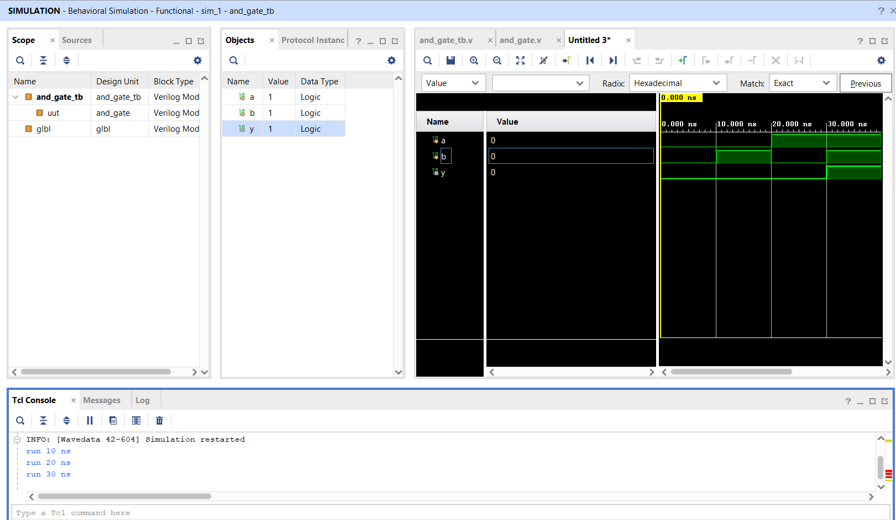
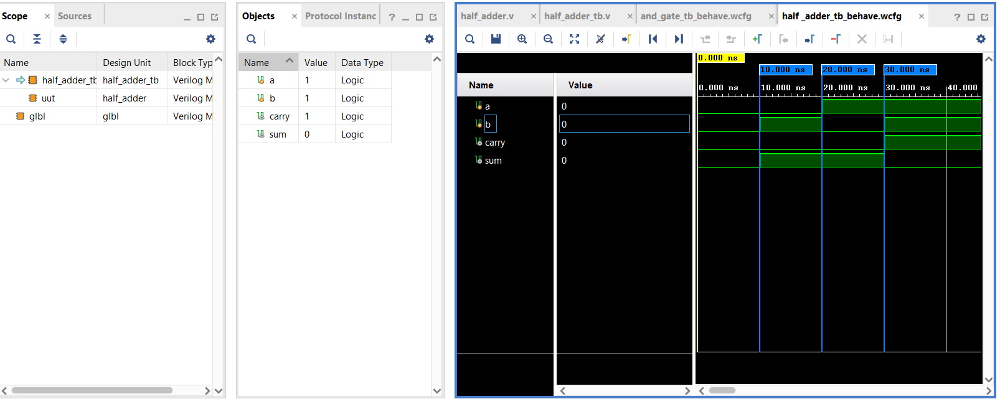
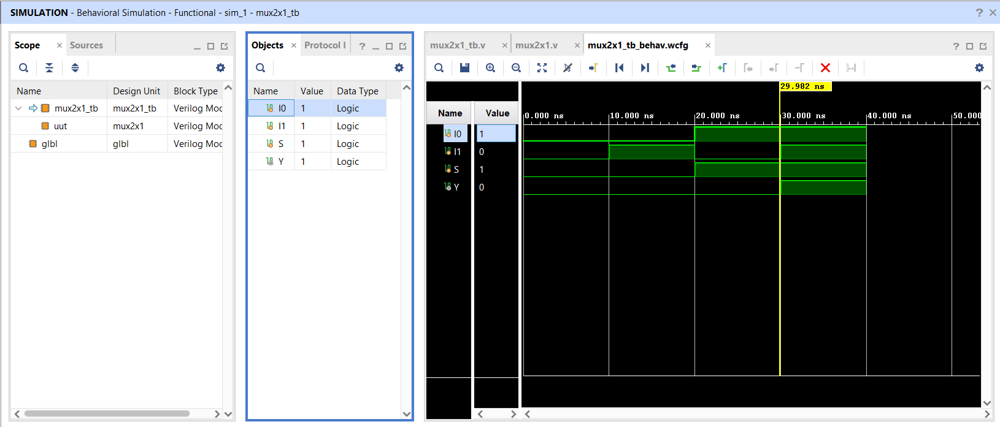

# Vivado Verilog Projects

A collection of Digital Logic Design projects implemented using **Verilog HDL** and verified through simulation in **Xilinx Vivado**.

## Overview

This repository documents my learning journey in **FPGA Design, Digital Electronics, and RTL Design**. Each project is developed using Verilog HDL and verified through behavioral simulation in Vivado.

### Repository Contents

Each project typically includes:

* Verilog source code (`.v`)
* Testbench (`_tb.v`)
* Simulation waveform screenshots
* Project description and verification results

---

## Projects

### 1. AND Gate

**Description:**
Design and simulation of a 2-input AND gate.

**Files**

* `and_gate.v`
* `and_gate_tb.v`
* `and_gate.png`

#### Simulation Waveform

---

### 2. Half Adder

**Description:**
Design and simulation of a Half Adder that generates **Sum** and **Carry** outputs.

**Files**

* `half_adder.v`
* `half_adder_tb.v`
* `half_adder_waveform.png`

#### Simulation Waveform

---

### 3. Full Adder

**Description:**
Design and simulation of a Full Adder capable of adding three binary inputs and generating Sum and Carry outputs.

**Files**

* `full_adder.v`
* `full_adder_tb.v`
* `full_adder.png`

---

### 4. 2:1 Multiplexer

**Description:**
Implementation and simulation of a 2:1 Multiplexer using Verilog HDL.

**Files**

* `mux2x1.v`
* `mux2x1_tb.v`
* `mux2x1.png`

#### Simulation Waveform

---

## Tools & Technologies

* Verilog HDL
* Xilinx Vivado
* RTL Design
* Behavioral Simulation
* FPGA Design Fundamentals

---

## Learning Roadmap

Upcoming projects to be added:

* 4:1 Multiplexer
* 2-to-4 Decoder
* 4-to-2 Encoder
* D Flip-Flop
* JK Flip-Flop
* Shift Registers
* Counters
* Sequence Detectors
* Finite State Machines (FSM)
* UART Communication
* FPGA-Based Mini Projects

---

## Skills Demonstrated

* Digital Logic Design
* RTL Coding
* Testbench Development
* Functional Verification
* FPGA Design Flow
* Verilog HDL Programming

---

## Author

**Shivangi Panigrahy**
Electronics and Communication Engineering (ECE) Student

Passionate about FPGA Design, VLSI, Digital Electronics, and Embedded Systems.

GitHub: @Shivangi210606

---

⭐ If you find these projects helpful, feel free to star the repository and follow my learning journey in Digital Design and FPGA Development.

